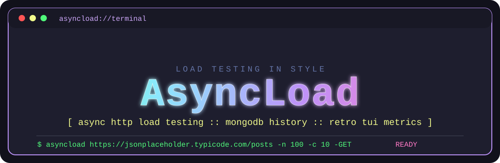
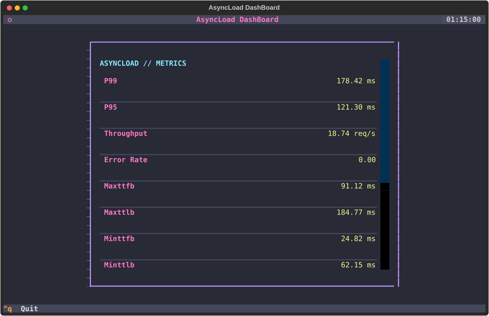
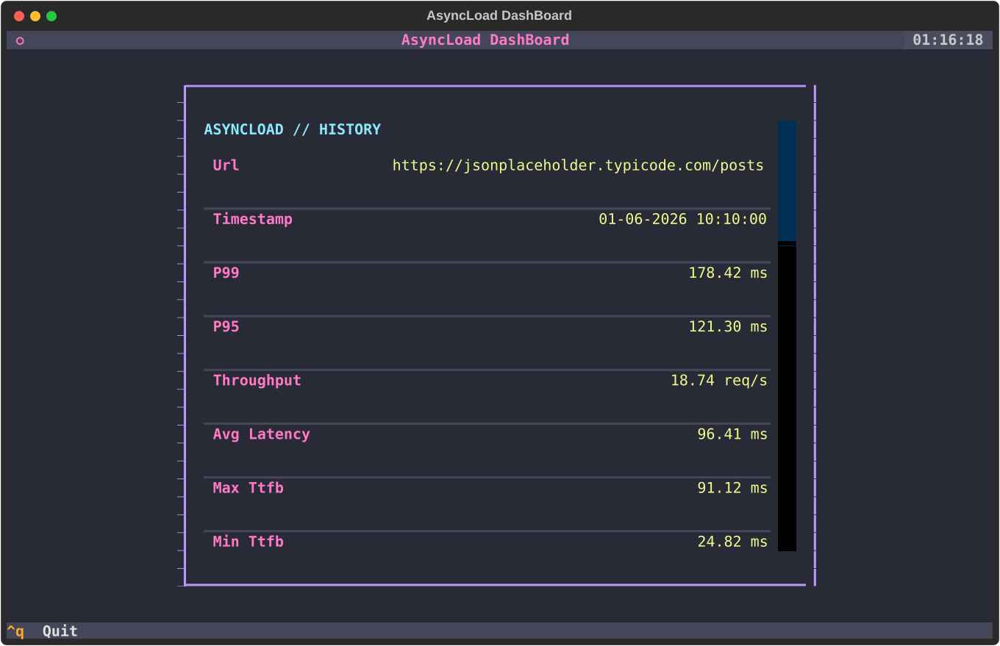
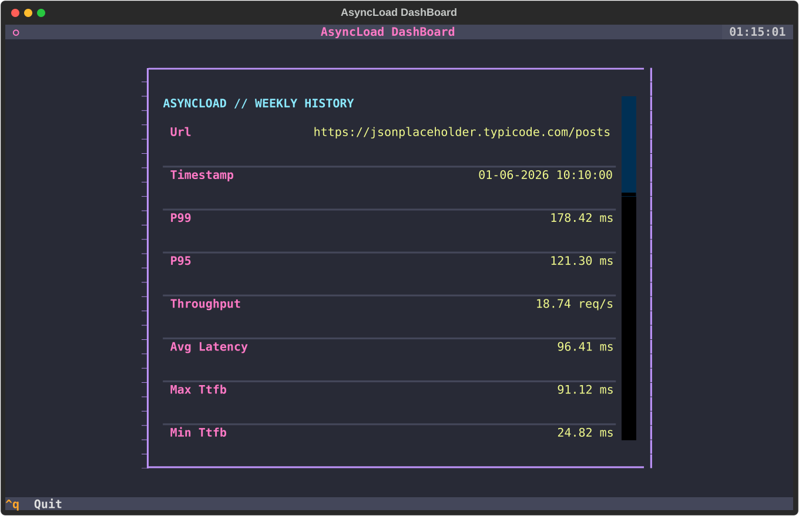
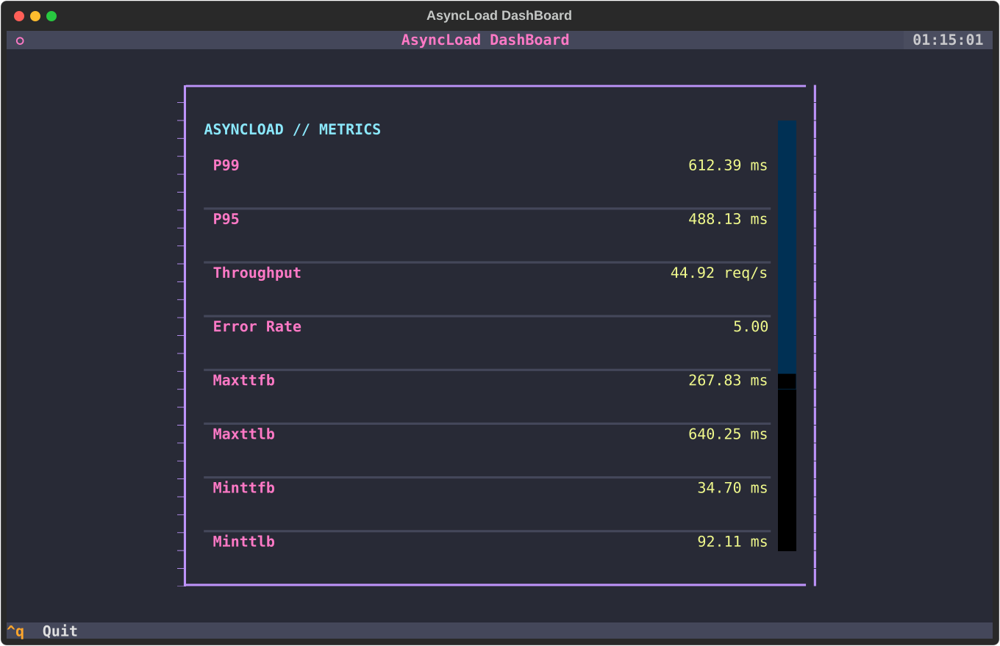

# AsyncLoad

AsyncLoad is an asynchronous load testing CLI designed to stress test your applications under heavy concurrent load with mongodb storage for session history and a TUI for displaying stats.

---

## Requirements
- Python 
- Textual
- Mongodb

## Installation

### Install from pip

For version releases, use pip:

```bash
pip install AsyncLoad
asyncload -setup
```
- Set your mongodb env variables inside the global config file thats created. "%LOCALAPPDATA%/AsyncLoad/config.env" for Windows, "~/.config/loadtester/config.env" for linux and Mac. You can setup the number of requests,concurrent requests, as well as the http method either in the config file or simply use the cmd flags to override the values. Default values for number of requests,concurrent requests,http method is 100,10,GET.   


Head over to your cmd and type:

```bash
asyncload https://httpbin.org/ -n 100 -c 10 -GET
```

### Install from GitHub source

For building from source, install directly from the git repository:

```bash
git clone https://github.com/Saptarshi2001/AsyncLoad.git
cd Asyncload
pip install .
cp config.env.example config.env # set up your config file 
python -m unittest discover tests/ # Run all tests
asyncload https://httpbin.org/ -n 100 -c 10 -GET
```

Or Use Docker to build and run the source:

```bash
docker compose build
docker compose run --rm asyncload https://httpbin.org/ -n 100 -c 10 -GET
```
- If you want to only use the asyncload container without the mongo container,then:
```bash
docker compose run --rm --no-deps -e MONGO_URL=mongodb://host.docker.internal:27017 asyncload https://httpbin.org/ -n 100 -c 10 -GET
```
- Make sure that the http method in the config file is GET,POST,PUT,PATCH,DELETE

Docker Compose starts a MongoDB service automatically and points AsyncLoad to it with `MONGO_URL=mongodb://mongo:27017`. For local runs outside Docker, keep `MONGO_URL` pointed at your local MongoDB instance, such as `mongodb://127.0.0.1:27017`.


### Running the tests

```bash
# Run all tests
python -m unittest discover tests/

# Run specific test modules
python -m unittest tests.test_load
python -m unittest tests.test_async
python -m unittest tests.test_db
python -m unittest tests.test_integration

# Run with verbose output
python -m unittest -v tests.test_load
```


## Examples

### Basic load test

```bash
asyncload https://jsonplaceholder.typicode.com/posts -n 5 -c 2 -GET
```


### Load test using only the config file 
```bash
asyncload https://jsonplaceholder.typicode.com/posts
```
### Override using flags
```bash
asyncload https://jsonplaceholder.typicode.com/posts -n 10 -GET
```
```bash
asyncload https://jsonplaceholder.typicode.com/posts -GET
```
```bash
asyncload https://jsonplaceholder.typicode.com/posts -POST -d '{"title": "foo", "body": "bar", "userId": 1}'
```

### Viewing history

```bash
asyncload -history
```



### Viewing weekly history

```bash
asyncload -history -weekly
```



### POST request with payload
#### In Windows
- If you are using git bash use 
```bash
asyncload https://jsonplaceholder.typicode.com/posts -n 5 -c 2 -POST -d '{"title": "foo", "body": "bar", "userId": 1}'
```
- If you are using powershell or windows cmd use
```bash
asyncload https://jsonplaceholder.typicode.com/posts -n 5 -c 2 -POST -d '{""title"": ""foo"", ""body"": ""bar"", ""userId"": 1}'
```
- In linux or mac this works,
```bash
asyncload https://jsonplaceholder.typicode.com/posts -n 5 -c 2 -POST -d '{"title": "foo", "body": "bar", "userId": 1}'
```


### High concurrency test

```bash
asyncload https://jsonplaceholder.typicode.com/posts -n 1000 -c 200 -GET
```



---

## API Reference

## GlobalConfig

### platform_path()

sets up the global config variable accordingly with the underlying os 

- "%LOCALAPPDATA%/asyncload/config.env" for Windows
- "~/.config/asyncload/config.env" for Linux/Mac

### ensure_global_config()

Creates the global config file in the user's system


## LoadRunner

### main()

Starts off the cli.

---

### run(url, numreq, conreq, reqtype, headers=None)

The core execution function of AsyncLoad. Sends requests to the specified URL asynchronously and calculates the stats.

**Parameters:**

| Name | Type | Description |
|------|------|-------------|
| `url` | `str` | The URL to test |
| `numreq` | `int` | Number of total requests |
| `conreq` | `int` | Number of concurrent requests |
| `reqtype` | `str` | HTTP method (GET, POST, PUT, DELETE, etc.) |
| `body` | str \| None | request body to be used during POST,PUT,PATCH requests |

---

## Record
### insertmetrics(reqlist)

Stores the metrics that you get from the load test in a mongodb instance.

**Parameters:**

| Name | Type | Description |
|------|------|-------------|
| `metrics` | `dict` | load test metrics  |

---

### getmetrics(timemode=None)

Retrieves the metrics stored as session history from the database.

**Parameters:**

| Name | Type | Description |
|------|------|-------------|
| `timemode` | str \| None | specifies the time range of session history that is to be fetched 

###  _time_range(timemode=None):

Calculates the start and end date for fetching session history.If timemode is not given ,it fetches all the records right from the earliest record until the present moment. 

**Parameters:**

| Name | Type | Description |
|------|------|-------------|
| `timemode` | str \| None | specifies the time range of session history that is to be fetched |

---

## ProtocolParser

### parse()

Parses the command line arguments and returns the values as a Params object that is used by the loadrunner for executing run() or fetch session history.


---

### add_args()

Adds the common cli flags like url,history,setup,number of requests,concurrent requests,data and history time filters.

---

### add_mutually_excusive_groups()

Adds the mutually exclusive HTTP method flags so that only one method like GET,POST,PUT,DELETE or PATCH can be selected at a time.

---

## Params

Stores the parsed command line values returned from `ProtocolParser.parse()`.

**Fields:**

| Name | Type | Description |
|------|------|-------------|
| `url` | `str` | The URL to load test |
| `numreq` | `int` | Number of total requests |
| `conreq` | `int` | Number of concurrent requests |
| `method` | `str` | HTTP method to use |
| `timemode` | str \| None | history range like weekly,monthly or yearly |
| `body` | str \| None | JSON request body parsed from `-d` or `--data` |

---

## EnvKeys

Stores the environment variable names later used by AsyncLoad.

**Fields:**

| Name | Description |
|------|-------------|
| `MONGO_URL` | MongoDB connection URL |
| `MONGO_DATABASE` | MongoDB database name |
| `MONGO_COLLECTION` | MongoDB collection name |
| `TIMEOUT` | Request timeout value |
| `TOTAL_REQUESTS` |  total request count |
| `CONCURRENT_REQUESTS` |  concurrent request count |
| `HTTP_METHOD` |  HTTP method |

---

## Env

Dataclass used for composing the env values in a single unit.

**Fields:**

| Name | Type | Description |
|------|------|-------------|
| `MONGO_URL` | `str` | MongoDB connection URL |
| `DATABASE` | `str` | MongoDB database name |
| `COLLECTION` | `str` | MongoDB collection name |
| `TIMEOUT` | `int` | Request timeout value |
| `TOTAL_REQUESTS` | `int` |  total request count |
| `CONCURRENT_REQUESTS` | `int` |  concurrent request count |
| `HTTP_METHOD` | `str` |  HTTP method |

---

### getenv()

Reads the environment variables from .env file and returns them inside an `Env` dataclass.

---

## MetricRow

### _format_value(name,value)

Formats metric values before they are displayed in the terminal.

**Parameters:**

| Name | Type | Description |
|------|------|-------------|
| `name` | `str` | metric name |
| `value` |  str \| int \| float \| | name of the metric as well as its value to be displayed |

---

## Terminal

### compose()

Builds the Textual terminal UI.It displays either the current metrics  or the session history records.

---

### _compose_history()

Builds the history view in the terminal.It displays the URL,timestamp and metrics for each stored history record.

---

### _title()

Returns the title shown at the top of the terminal dashboard.

---

### _format_timestamp(timestamp)

Formats timestamps for display in the terminal.

**Parameters:**

| Name | Type | Description |
|------|------|-------------|
| `timestamp` | datetime \| None | date and time that is to be formatted before being displayed

---

### displaystats()

Starts the Textual application and shows the metrics dashboard in the terminal.

---


### Options

| Flag | Description |
|------|-------------|
| `-n` | Number of requests |
| `-c` | Number of concurrent requests |
| `-GET` / `-POST` / `-DELETE` / `-PUT` / `-HEAD` / `-PATCH` | HTTP method |
| `-d` | JSON data for POST/PUT/PATCH/DELETE |
| `-history` | View session history |
| `-history -weekly` | View weekly session history |
| `-history -monthly` | View monthly session history |
| `-history -yearly` | View yearly session history |

---

## Changelog

### [0.1.5] - 2026-06-01
- Asynchronous load testing CLI with concurrent request support
- Mongodb Database storage for session history using SQLite
- Support for multiple HTTP methods (GET, POST, PUT, DELETE, HEAD, PATCH)
- Configurable concurrency and request count
- Session history viewing (weekly, monthly, yearly) 
- Load testing stats 
- TUI views
